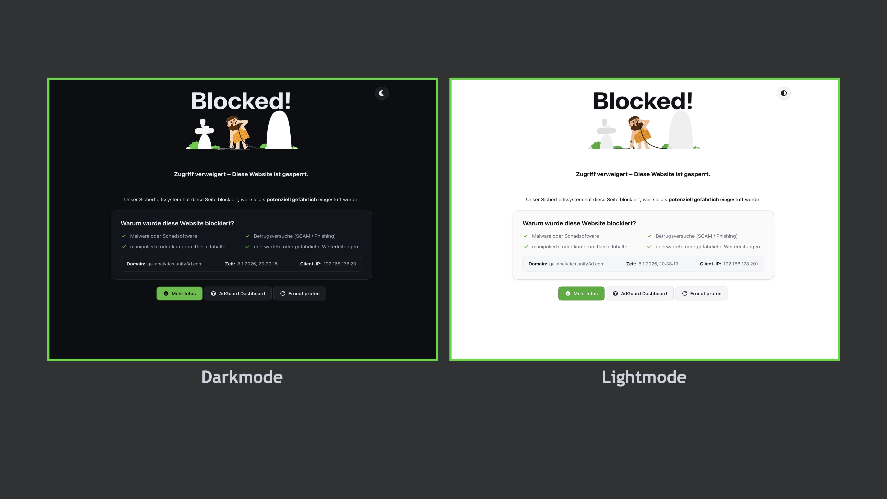

# 🦊 Foxly's AdGuard Blockpage

Eine anpassbare Block-Seite für AdGuard Home – modern, humorvoll und mit rotierenden IT-Witzen.



## 🚀 Schnellstart (Docker)

```bash
cd adguard-blockpage
docker compose up -d
```

Öffne danach: `http://<server-ip>:8080`

## 🧩 AdGuard Home Integration

**Option 1: Globale Umleitung**  
Settings → DNS blocking → **Use custom IP for blocked hosts** → IP dieses Servers eintragen.  
Hinweis: Bei HTTPS kommt technisch bedingt eine Zertifikatswarnung – normal und erwartbar.

**Option 2: Per Regel (Feintuning)**
```
||example.com^$dnsrewrite=NOERROR;A;10.100.0.20
```

## ⚙️ Bare-Metal nginx

```bash
sudo mkdir -p /opt/adguard-blockpage
sudo rsync -a web/ /opt/adguard-blockpage/
sudo cp nginx/adguard-blockpage.conf /etc/nginx/conf.d/adguard-blockpage.conf
sudo nginx -t && sudo systemctl reload nginx
```

## 📜 Lizenz

MIT © 2025 Foxly IT
