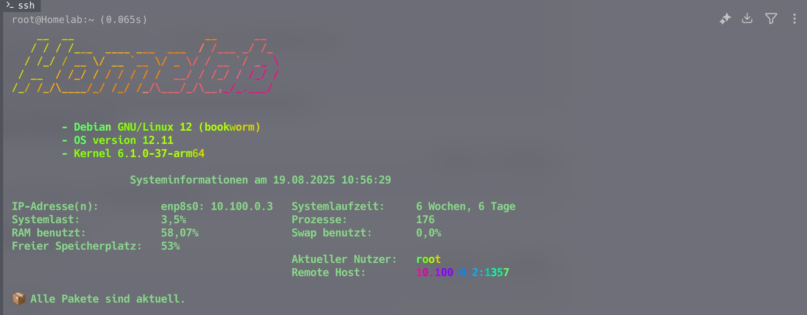

# MOTD – farbiger Hostname + deutsches System-Dashboard (Ubuntu/Debian)

Dieses Projekt liefert ein modernes, dynamisches MOTD:
- 🌈 Hostname-Banner (FIGlet + lolcat, mit TTY-losen Logins kompatibel)
- 🇩🇪 deutsche Systemlaufzeit (ab ≥ 1 Woche ohne Stunden/Minuten)
- 📊 Systemlast in %, RAM/Swap-Nutzung, freier Speicherplatz in % uvm.
- 🌐 nur **Hardware-NICs** (keine Docker/veth/lo), mehrere IPs werden sauber angezeigt
- 🎨 angenehmes Grün für die Tabelle; **nur die Werte** von „Aktueller Nutzer“ & „Remote Host“ werden mit einem gut lesbaren lolcat-Verlauf eingefärbt

> Getestet auf Ubuntu/Debian mit `pam_motd`/`run-parts`.

---

## Installation

```bash
git clone https://github.com/foxly-it/dotfiles.git
cd dotfiles/motd-scripts
sudo bash install.sh
```


### Deaktivieren der Ubuntu-Standardmeldungen
```bash
sudo chmod -x /etc/update-motd.d/80-* /etc/update-motd.d/90-* /etc/update-motd.d/91-*
```

## Vorschau
```bash
sudo run-parts /etc/update-motd.d
```

## Anpassen
**Öffne 10-sysinfo:**
- Farbe: COLOR="\033[38;5;114m" → angenehmes Grün (256-Farben). Für klassisches Grün: \033[0;32m.
- Spaltenabstand: GAP=3
- lolcat-Stil für rechte Werte: LOLCAT_ARGS="-f -p 1.2 -F 0.3"
- Nur Hardware-IPs: gesteuert über get_hw_ipv4s() (filtert nach /sys/class/net/<iface>/device)
- Remote-Host: robuste Erkennung über SSH_* → who --ips/who -m → ss/sshd PID

## Troubleshooting
**Keine Farben beim Login?**
`lolcat` wird mit `-f` auf TTY-lose Ausgaben gezwungen. Prüfe:
`command -v /usr/local/bin/lolcat` → Pfad muss existieren.
**Remote Host zeigt `N/A?`**
Manche Umgebungen befüllen utmp/Env nicht. Wir versuchen: `SSH_CLIENT` → `who --ips` → `who -m` → `ss` (Peer aus sshd).
Prüfe manuell:

```bash
echo "$SSH_CLIENT" ; echo "$SSH_CONNECTION"
tty
who --ips ; who -m
ss -Htnp state established | head
```